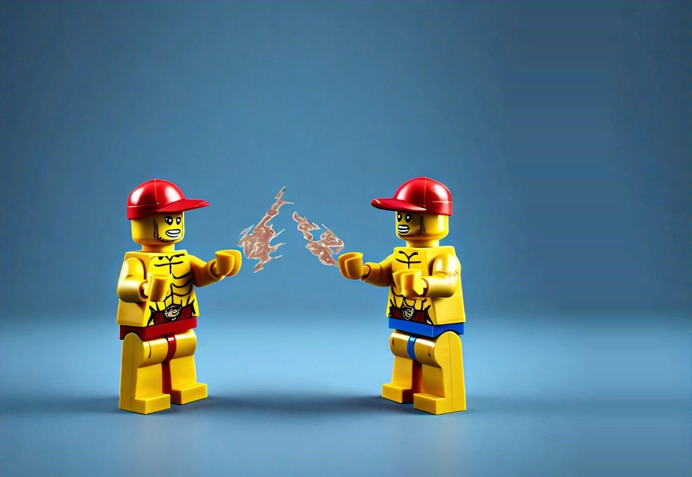

# Seam Carving Image Resizer

## Overview

Seam carving is an image resizing technique that allows for content-aware resizing of images by removing or adding seams. A seam is a connected path of pixels that extends from the left to right of an image. This project implements seam carving to resize images while preserving important content and avoiding distortions.


## Examples:
### Here is an example of reducing the size of an image without altering its important contents:
#### original images:

#### carved images:


#### original images:

#### carved images:


### Here is an example of expanding or increasing the size of an image without altering its important contents:
###### Note: this feature is not yet fully improved
#### original images:

#### carved images:


## Tech Stack

- **Python**: Programming language used.
- **NumPy**: Library for numerical operations and array manipulations.
- **OpenCV**: Library used for image processing.
- **PIL (Pillow)**: Library used for image loading and saving.

## How It Works

### 1. Calculate Energy Map

The `calculate_energy_map` function computes the energy of each pixel in the image using the Sobel operator. The energy map highlights the importance of pixels based on their gradients, where higher energy values represent more important regions.

```python
def calculate_energy_map(image):
    gray_image = cv2.cvtColor(image, cv2.COLOR_BGR2GRAY)
    sobel_x = cv2.Sobel(gray_image, cv2.CV_64F, 1, 0, ksize=3)
    sobel_y = cv2.Sobel(gray_image, cv2.CV_64F, 0, 1, ksize=3)
    energy_map = np.sqrt(sobel_x**2 + sobel_y**2)
    energy_map = (energy_map / np.max(energy_map) * 255).astype(np.uint8)
    return energy_map
```

### 2. Compute Cumulative Energy Map

The `compute_cumulative_energy` function uses dynamic programming to compute a cumulative energy map, which helps in finding the least-energy seam.

```python
def compute_cumulative_energy(energy_map):
    rows, cols = energy_map.shape
    cumulative_energy = np.copy(energy_map).astype(np.float64)
    
    for i in range(1, rows):
        left = np.roll(cumulative_energy[i-1, :], shift=1)
        left[0] = np.inf
        right = np.roll(cumulative_energy[i-1, :], shift=-1)
        right[-1] = np.inf
        
        cumulative_energy[i, :] += np.minimum(np.minimum(left, cumulative_energy[i-1, :]), right)
    
    return cumulative_energy
```
### 3. Find Minimum Seam

The `find_min_seam` function identifies the seam with the minimum cumulative energy, ensuring that the least important pixels are removed.

```python

def find_min_seam(cumulative_energy):
    rows, cols = cumulative_energy.shape
    seam = np.zeros(rows, dtype=np.int64)
    
    seam[-1] = np.argmin(cumulative_energy[-1])
    
    for i in range(rows - 2, -1, -1):
        j = seam[i + 1]
        if j > 0 and cumulative_energy[i, j - 1] == min(cumulative_energy[i, max(j - 1, 0):min(j + 2, cols)]):
            seam[i] = j - 1
        elif j < cols - 1 and cumulative_energy[i, j + 1] == min(cumulative_energy[i, max(j - 1, 0):min(j + 2, cols)]):
            seam[i] = j + 1
        else:
            seam[i] = j
    
    return seam
```
This function uses dynamic programing to find the minimum seam in the image with a bottom up approach.
#### Cumulative Energy Formula

For a pixel located at position (i,j)(i,j) in the cumulative energy map, the cumulative energy is computed as:

C(i,j)=E(i,j)+min⁡(C(i−1,j−1),C(i−1,j),C(i−1,j+1))C(i,j)=E(i,j)+min(C(i−1,j−1),C(i−1,j),C(i−1,j+1))

where:

    C(i,j)C(i,j) is the cumulative energy of the pixel at row ii and column jj.
    E(i,j)E(i,j) is the energy of the pixel at row ii and column jj (from the energy map).
    C(i−1,j−1)C(i−1,j−1) is the cumulative energy of the pixel in the row above and one column to the left.
    C(i−1,j)C(i−1,j) is the cumulative energy of the pixel in the row above and the same column.
    C(i−1,j+1)C(i−1,j+1) is the cumulative energy of the pixel in the row above and one column to the right.

### 4. Remove Seam

The `remove_seam` function removes the identified seam from the image, reducing its width by one pixel.

```python

def remove_seam(image, seam):
    rows, cols, _ = image.shape
    new_image = np.zeros((rows, cols - 1, 3), dtype=np.uint8)
    
    for row in range(rows):
        col = seam[row]
        new_image[row, :, :] = np.concatenate([
            image[row, :col, :],
            image[row, col + 1:, :]
        ], axis=0)
    
    return new_image
```

### 5. Add Seam

The `add_seam function` attempts to add a seam to the image, but currently it only duplicates the seam. This functionality needs improvement.

```python

def add_seam(image, seam):
    rows, cols, _ = image.shape
    new_image = np.zeros((rows, cols + 1, 3), dtype=np.uint8)
    
    for row in range(rows):
        col = seam[row]
        new_image[row, :col, :] = image[row, :col, :]
        new_image[row, col, :] = image[row, col, :]
        new_image[row, col + 1:, :] = image[row, col:, :]
    return new_image
```

## Usage

Load an image and convert it to a NumPy array.
Apply the seam carving functions to remove seams.
Convert the result back to an image and display it.

```python

# Load the image
src = np.array(Image.open("image.jpg"))

# Carve the image
for _ in range(300):
    energy_map = calculate_energy_map(src)
    cumulative_energy = compute_cumulative_energy(energy_map)
    seam = find_min_seam(cumulative_energy)
    src = remove_seam(src, seam)

# Convert the carved image to PIL Image and display it
carved_image_pil = Image.fromarray(src)
carved_image_pil.show()
```


## Scope for Improvement

GUI Integration: A graphical user interface (GUI) could make it easier to interact with the seam carving tool, allowing users to visually select regions to remove or add seams.

Seam Addition: The current implementation of seam addition simply duplicates the existing seam. Future improvements could include more sophisticated methods for expanding the image, such as using interpolation techniques to fill in new seams with plausible content.

